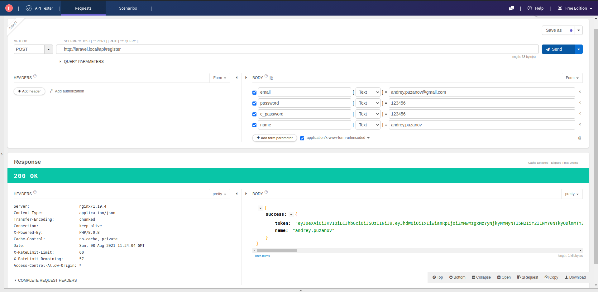
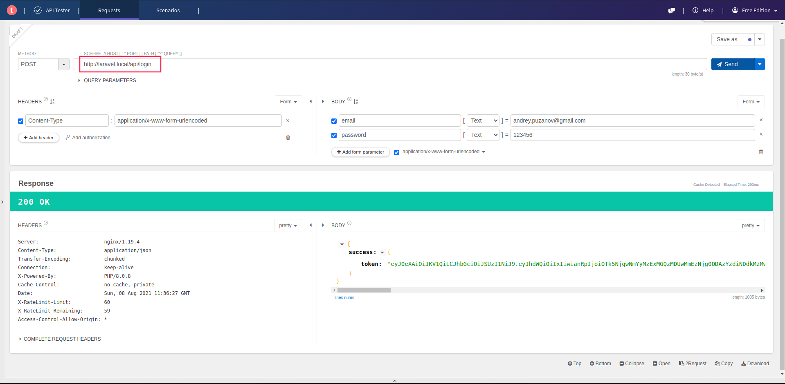
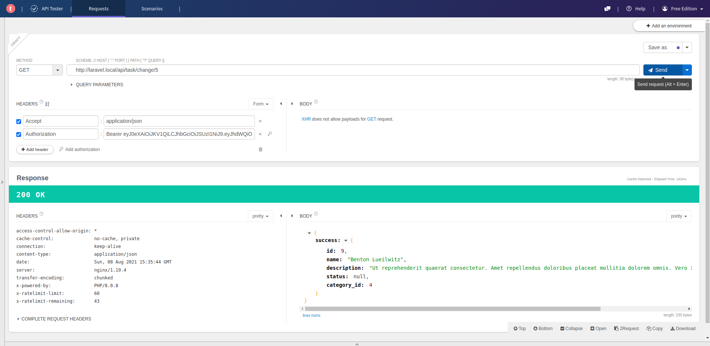
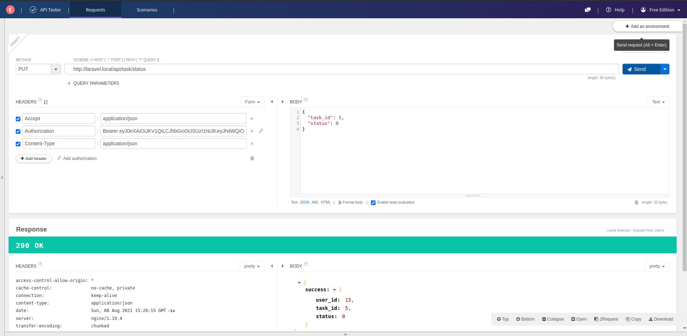
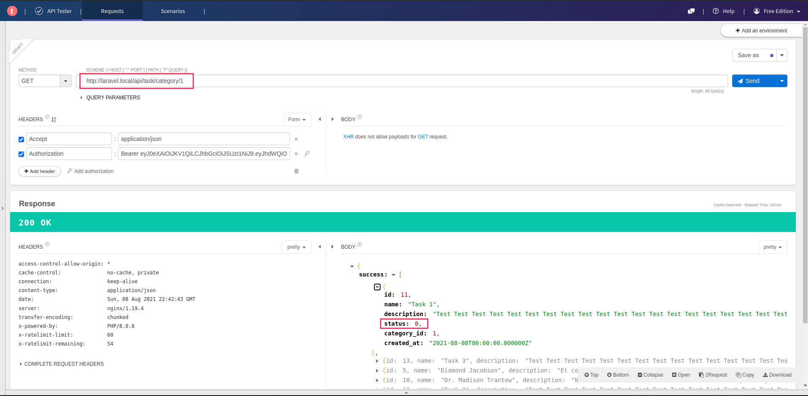

### Db migration
- [x] User (user)
- [x] Category (category)
- [x] User Task (user_task)
- [x] Task (task)

### Tasks for API
- [X] Регистрация/авторизация пользователя
- [x] Метод получения подборки заданий для пользователя. Задание должно относиться к одной категории. В полученном списке должно быть понятно какие задачи выполнены, а какие еще нет;
- [x] Метод для пометки задачи как выполненное;
- [x] Метод замены задания на другое (например, если задание не интересно);

### ScreeShots
##### API Registration

##### API Login

##### API Change Task

##### API Set Status

##### API Get Tasks
